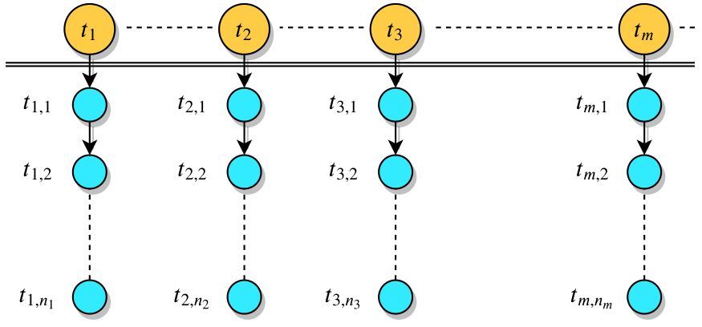

# NesTPP
A novel framework for learning latent information diffusion mechanism in online discussion forums.

This is a implementation of the nested self-exciting point process, as described in our paper:  
Chen Ling, Guangmo Tong, and Mozi Chen, [NesTPP: Modeling Thread Dynamics in Online Discussion Forums](https://arxiv.org/abs/2003.06051) (HT 2020)

## Requirements
This code is written in Python. To use it you will need:
- Numpy > 1.16
- Scipy > 1.2
- pandas


## Usage
### Run the demo
```
python ntpp.py
```

### Data
The data used in the paper can be access with this [link](https://drive.google.com/drive/folders/1uZudmS2y9npqG0sbfLy6AlduwFG32Kbg?usp=sharing). Please put the data folder in the folder of NesTPP to correctly read it.

In order to use your own data, you'll have to provide:
- An N size array recording the arrival time of N main threads
- An N by D ndarray recording the arrival time of D replies of each main threads. Note that the number of D for each replies list can be different. 

[Pushshift](https://github.com/pushshift/api) is an efficient way of searching threads and associated replies on Reddit, which is the data source of our paper.

### Model
Online discussion forum creates an asynchronous conversation environment for online users to exchange ideas and share opinions through a unique thread-reply communication mode. In this work, we view the entire event space of an online discussion forum as a nested point process. An illustration is given as following:


## Cite
```
@article{ling2020nestpp,
  title={NesTPP: Modeling Thread Dynamics in Online Discussion Forums},
  author={Ling, Chen and Tong, Guangmo and Chen, Mozi},
  journal={arXiv preprint arXiv:2003.06051},
  year={2020}
}
```
